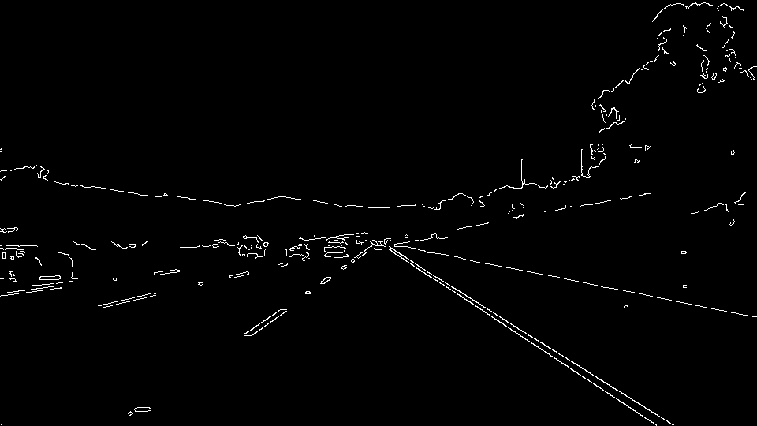
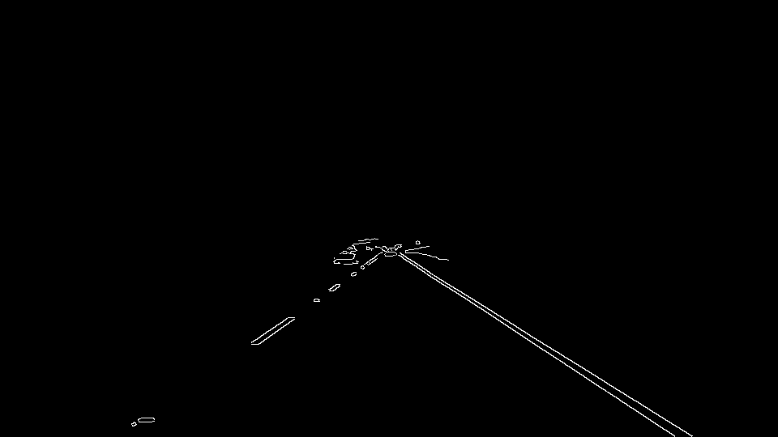

# **Finding Lane Lines on the Road**

---

**Finding Lane Lines on the Road**

The goals / steps of this project are the following:
* Make a pipeline that finds lane lines on the road
* Reflect on your work in a written report

---

### Reflection

My pipeline followed a fairly common pre-processing flow used in computer vision. The main steps consisted of the following:
* Grayscale             - Create a single channel image binary
* Gaussian Blur         - Remove noise
* Canny edge detection  - w/auto-threshold. Bring out edge pixels along high contrast boundaries
* Region of Interest    - Apply an image mask to exclude properties outside a defined region
* Hough Lines           - Detect lines in hough space
* Annotate Image        - Average, extrapolate, and draw a single line for both right and left lane lines

In order to draw a single line on the left and right, I modified the draw_lines() function by first separating the lines by slope by applying an index mask (a.k.a. "Fancy Indexing"). Each group of lines is then sent through a linear regression to identify individual line slopes and axis intercepts. These were then mean averaged to a single line segment and extending from the bottom border to reasonable vantage point.

### 2. Potential shortcomings with the current pipeline

The current pipeline relies on static parameters tested against a small sample of images. I can foresee several potential shortcomings with this sort of manually configured approach and small sample size. For instance, this pipeline does not account for various real-world situations such as obstruction of the camera or of the lane line, optical illusions, glare, reworked roads with extra markings or no markings, snowfall just to name a few. It also relies on a single vantage point, resulting in a likely single point of failure.

### 3. Possible improvements to the pipeline

The "challenge" video illustrates the need for additional pre-processing. The first improvement would be to process the lane color based on hue/value/saturation to account for changes in lighting and road materials such as the bridge and shadows.

Another possible improvement would be to replace the arrays with a lightweight queue to handle steady streams of images while keeping processing and memory usage to a minimum.

I'm also curious to try different methods of sampling the image by factoring distant or long-range scene separately from the proximal or near-range scene.
